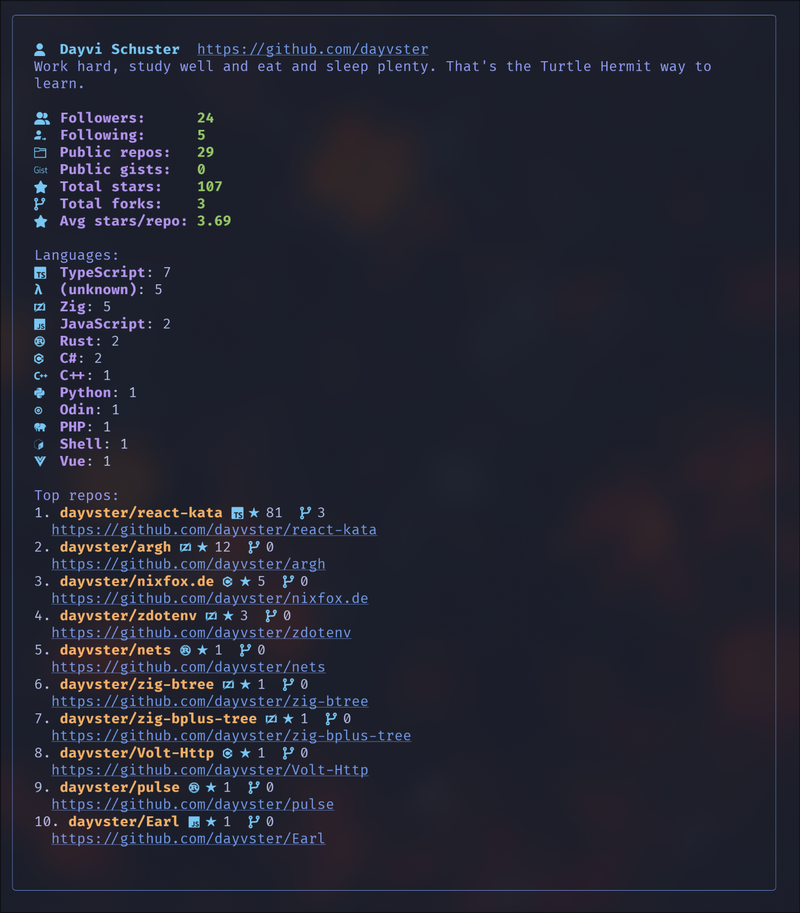
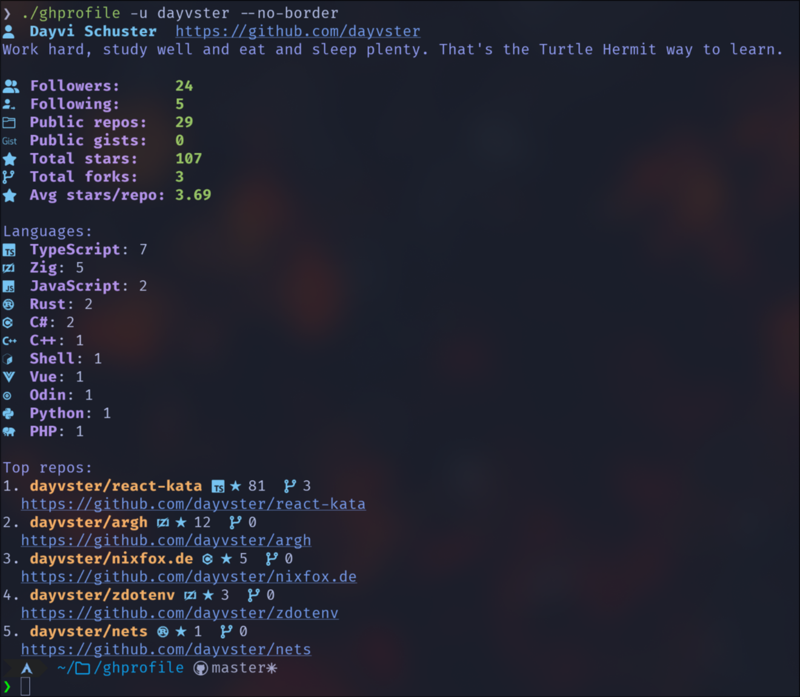
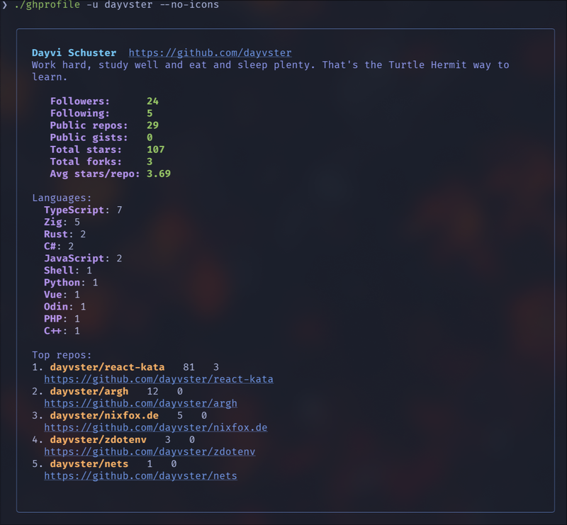

<div align="center">

# ghprofile 

A beautiful, customizable GitHub profile viewer for your terminal.

---

<p>
  <a href="LICENSE"></a>
  
  
  
  
  
  
  
</p>

</div>

---

## Features
- ✨ Fetch and display GitHub user profiles and top repositories
- 📊 Shows language stats, repo stars, forks, and more
- 🎨 Icon-rich output (with options for plain text)
- ⚡ Caching and demo mode for offline/limited API use
- 🛠️ CLI flags for customization

---

## Usage
```sh
./ghprofile [flags]
```

### Flags
- `-u`, `--user`        GitHub username to fetch (default: dayvster)
- `-n`                  How many top repos to show (default: 5)
- `--no-icons`          Disable icons in the output
- `--no-border`         Remove card border from output
- `--no-style`          Remove all styles from output
- `--no-demo`           Do not fall back to demo data on fetch error; exit instead
- `--demo`              Force demo data (skip network and cache)
- `-h`, `--help`        Show help message

---

## Screenshots
| Default | No Border | No Icons |
|---------|-----------|----------|
|  |  |  |

---

## Build
```sh
go build -o ghprofile ./cmd/main.go
```

## Example
```sh
./ghprofile --user dayvster --topN 5
```

---

## License
See [LICENSE](LICENSE).

## Contributing
See [CONTRIBUTING.md](CONTRIBUTING.md).
